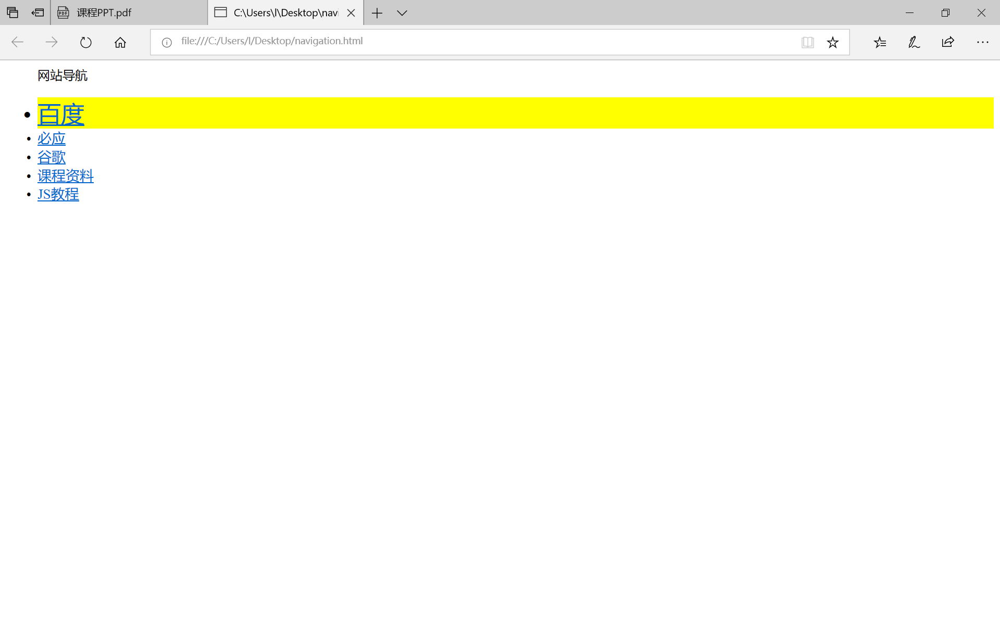
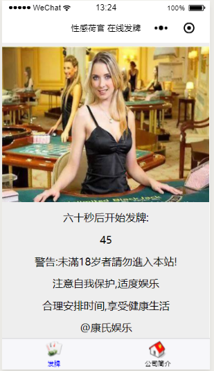
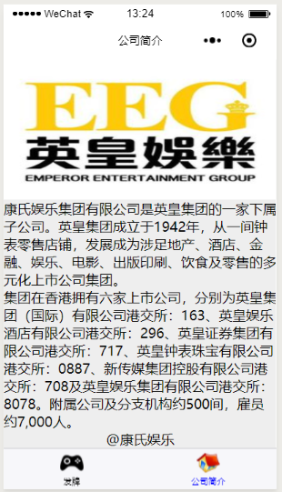
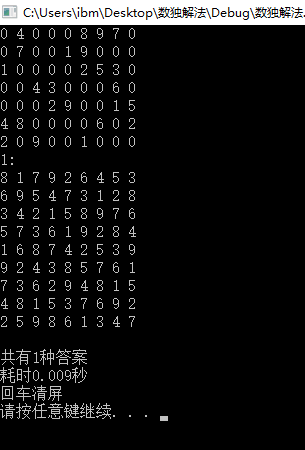

# 总的介绍
***
# 陈达的demo
## 用途
网址导航  
## 如何运行
双击navigation.html
## 示意图

## 代码

```JavaScript

<head>
<title></title>
<script type="text/javascript">

function initEven() 
{
  var guides = document.getElementById("guide"); 
  var lis = guides.getElementsByTagName("li"); 
  for (var i =0; i < lis.length; i++)
  { 
     var li = lis[i];
     li.onmouseover =function()      //当鼠标移动到某个li上时执行
     { 
          var guides = document.getElementById("guide"); 
          var lis = guides.getElementsByTagName("li");
          for (var i =0; i < lis.length; i++)
          { 
              var li = lis[i];
              if (li ==this) 
              {
                 li.style.background ="yellow"; //将当前背景设为黄色
                 this.style.fontSize =30;  //将字体设为30号
              }
              else 
              {
                li.style.background ="white"; //将其余背景设为白色
                li.style.fontSize =18; //将其余字体设为18号
              }
          }
     }
  }
}
</script>
</head>

<body onload="initEven()">
<ul id="guide">
网站导航<br/><br/>
<li><a href="https://www.baidu.com/">百度</a></li>
<li><a href="https://cn.bing.com/">必应</a></li>
<li><a href="https://www.google.com.hk/">谷歌</a></li>
<li><a href="https://github.com/jtext103/SoftwareEngneering/">课程资料</a></li>
<li><a href="http://www.w3school.com.cn/js/">JS教程</a></li>
</ul>
</body>

```
***
# HTML5实现简单的贪吃蛇小游戏

## 一、蛇身制作

蛇身由一系列方格组成，初始设定蛇身的长度是4，每吃到一次食物就增加1。

给组成蛇身的每一节一个坐标，并设定一个变量var lenth=4;来存放蛇身的长度。

最后用一个for循环for(i=0;i<lenth;i++)根据坐标，一个一个格子地画出蛇身。

## 二、蛇的前行

让下一节的坐标直接等于上一节当前的坐标就可以了。

```html
function move()
{for(i=(lenth-1);i>=1;i--)
 {worma[i]=worma[i-1];
  wormb[i]=wormb[i-1];}
}
```

第一节的坐标由蛇目前前进的方向（来自玩家的键盘输入）计算得出。

## 三、食物出现

使用random函数和floor函数来获得一个宽30高20范围内的随机坐标。

```html
function getfood()
{if(foodboolean==0)
 {fooda=Math.floor(Math.random()*20);
  foodb=Math.floor(Math.random()*30);
  foodboolean=1;
 }
```

## 四、判断是否咬到自己

如果蛇头（第一节）碰到了她自己身体的其他任意一节，那么这个时候，这2节的坐标是一样的。

我们可以根据这个来判断是不是咬到自己了。

```html
for(i=1;i<=lenth-1;i++)
{if ((worma[i]==worma[0])&&(wormb[i]==wormb[0]))
  {crash=1;}
}
```

## 五、自动前进和防止后退

键盘有4个方向，但是贪吃蛇在前进时，只有3个方向。我们只能让她向前，或左转，或右转，而不能向后转。所以如果玩家按了和当前前进方向相反的键盘按键，我们必须防止贪吃蛇反向移动。

方法是设定一个变量，direction，用于储存当前的移动方向。如果玩家没有新的输入，那么贪吃蛇一直沿原来的方向走；如果有新的输入，那么在判断新的方向“合法”之后，存入direction变量，取代原来的方向。

```html
function fkeydown(kd)
{if(Math.abs(direction-kd.keyCode)!=2)
 {dnext=kd.keyCode;};
}
```

## 六、最终代码

```html
<html>
<head>
<title>greedy snake from eev</title>
<script>
var x=0;
var y=0;
var i=0;
var a=0;
var b=0;
var fooda=0;
var foodb=0;
var foodboolean=0;
var lenth=4;
var timer=0;
var direction=39;
var dnext=39;
var crash=0;
var worma=new Array();
var wormb=new Array();
worma[0]=10;
wormb[0]=1;
worma[1]=9;
wormb[1]=1;
worma[2]=8;
wormb[2]=1;
worma[3]=7;
wormb[3]=1;
var nexta=10;
var nextb=1;
function getfood()
{if(foodboolean==0)
 {fooda=Math.floor(Math.random()*20);
  foodb=Math.floor(Math.random()*30);
  foodboolean=1;
 };
}
function next()
{direction=dnext;
 if (direction==37)
 {fleft();}
 else if(direction==38)
 {fup();}
 else if(direction==39)
 {fright();}
 else if(direction==40)
 {fdown();} 
}
function eat()
{lenth=lenth+1;
 move();
 foodboolean=0;
}
function eatormove()
{if((foodboolean==1)&&(nexta==fooda)&&(nextb==foodb))
 {eat();}
 else
 {move();};
}
function move()
{for(i=(lenth-1);i>=1;i--)
 {worma[i]=worma[i-1];
  wormb[i]=wormb[i-1];
 };
 worma[0]=nexta;
 wormb[0]=nextb;
}
function fleft()
{if(wormb[0]>=1)
 nextb=wormb[0]-1;
 else
 nextb=29;
}
function fright()
{if(wormb[0]<29)
 nextb=wormb[0]+1;
 else
 nextb=0;
}
function fup()
{if(worma[0]>=1)
 nexta=worma[0]-1;
 else
 nexta=19;
}
function fdown()
{if(worma[0]<19)
 nexta=worma[0]+1;
 else
 nexta=0;
}
function fkeydown(kd)
{if(Math.abs(direction-kd.keyCode)!=2)
 {dnext=kd.keyCode;};
}
function draw()
{ctx.clearRect(0,0,1200,800);
 for(i=0;i<=lenth-1;i++)
 {x=wormb[i]*40;
  y=worma[i]*40;
  ctx.fillStyle="red";
  ctx.fillRect(x,y,40,40);
 }
 if(foodboolean==1)
 {ctx.fillStyle="green";
  x=foodb*40;
  y=fooda*40;
  ctx.fillRect(x,y,40,40);
 } 
}
function refresh()
{timer=timer+1;
 for(i=1;i<=lenth-1;i++)
 {if ((worma[i]==worma[0])&&(wormb[i]==wormb[0]))
  {crash=1;};
 } 
 if ((timer%5==1)&&crash==0)
 {next();
  eatormove();
 };
 draw(); 
 getfood(); 
}
</script>
</head>
<body onkeydown="fkeydown(event)">
<canvas id="canvas01" width="1200" height="800" style="background-color:black">
</canvas>
<script>
var cvs=document.getElementById("canvas01");
var ctx=cvs.getContext("2d");
ctx.fillStyle="red";
var intval=setInterval("refresh();",100);
</script>
</body>
</html>
```

## 七、效果展示


***
# 微信小程序初尝试
## 程序介绍
    该程序主要构造了两个微信小程序页面，并且配置两个标签按钮通过点击使页面切换，主要的功能是实现一个60秒倒计时，并加入了一些文字和图片点缀，同时用到了页面布局的程序。
## 程序测试
程序是在*微信web开发者工具*上编写完成，在进行测试时应先安装上述工具，然后直接运行文件，在模拟器上即可查看效果。
## 项目使用
本项目是我对微信小程序的初步探索，仅实现了倒计时、设置标签栏，页面转换和排版等功能，没有实际的运用效果，但起到了熟悉开发环境、语言，文件设置，基本框架的作用。
## 主要代码
### 60秒倒计时
```java

// 从从60到到0倒计时

function countdown(that) {

  var second = that.data.second

  if (second == 0) {

    that.setData({

      second: "开始发牌！"

    });

    return;

  }

  var time = setTimeout(function () {

    that.setData({

      second: second - 1

    });

    countdown(that);

  }

    , 1000)

}


Page({

  data: {

    second: 60

  },

  onLoad: function () {

    countdown(this);

  }

});
```
### 文本格式
```java
.container{
  background-color:#eee;
  height:100vh;
  display:flex;
  flex-direction: column;
  justify-content: space-around;
  align-items: center;
}
```
### 设置标签栏
```java
{
 "pages":["pages/djs/djs","pages/v/v"
 ],
 "tabBar":{
   "list":[
     {
       "text": "发牌",
      "pagePath": "pages/djs/djs",
      "iconPath": "images/1.png",
      "selectedIconPath": "images/4.png"
     },
     {
       "text": "公司简介",
      "pagePath": "pages/v/v",
      "iconPath": "images/2.png",
      "selectedIconPath": "images/3.png"
     }
   ],
   "color":"#000",
   "selectedColor":"#00f"
 }
}
```
### 文本框
```java
<view class="container">
  <image src="/images/hg.jpg"></image>
  <text>六十秒后开始发牌: </text>
  <text> {{second}}</text>
 <text>警告:未滿18岁者請勿進入本站!</text>
 <text>注意自我保护,适度娱乐</text>
 <text>合理安排时间,享受健康生活</text>
 <text>@康氏娱乐</text>
</view>
```
### 小程序标题栏
```java
{
  "navigationBarTitleText":"性感荷官 在线发牌",
"navigationBarBackgroundColor":"#fff",
"navigationBarTextStyle":"black"
}
```
*ps:其它相似代码未列出。*
## 项目图示


## 参考资料
主要参考老师提供的[视频](https://www.bilibili.com/video/av25037513/?p=2)资料。

***
## 项目作者
气卓1601李睿康
## 致谢
石东源老师及助教
***
# 李越的作业扑克游戏
## 作用或达成效果
需要点击牌面使之翻转，当两牌一样时，牌面变回保持翻转过后的状态，直到所有牌面都被翻转游戏结束
## 如何运行
运行Poke.sln即可。
## 运行结果
！[成功](U201611937/屏幕快照.png)
***
# **周兆伟的demo**  
## *1.Project Title*  
这是一个用c++编写的数独求解程序，可以对未完成的数独进行求解。输入一个九行九列的数独，便能得到答案个数并列出所有解答同时统计计算时间。  
## *2.Getting Started*  
需要安装Visual Studio 2017，并能正常使用。  
## *3.Usage*  
在Visual Studio 2017中打开项目“数独解法”。运行程序后，按照提示在窗口输入待求数独便可得到所有答案。  
## *4.Source Code*  
```c++
#include<iostream>
#include<ctime>
using namespace std;
void shendusousuo(short m, short n);
bool jiance(short m, short n, short k);
void display();
short a[9][9];
short sum;
int main()
{
	clock_t start, finish;
	while (1)
	{
		sum = 0;
		cout << "请输入数独，空格用0代替，数字与数字之间用空格隔开，共九行九列" << endl;
		int i, j;
		for (i = 0; i < 9; i++)
		{
			for (j = 0; j < 9; j++)
			{
				cin >> a[i][j];
			}
		}
		start = clock();
		shendusousuo(0, 0);
		finish = clock();
		double totaltime = double(finish - start) / CLOCKS_PER_SEC;
		cout << "共有" << sum << "种答案" << endl;
		cout << "耗时" << totaltime << "秒" << endl;
		cout << "回车清屏" << endl;
		system("pause");
		system("cls");
	}
}
void shendusousuo(short m, short n)
{
	if (!a[m][n])
	{
		short k;
		for (k = 1; k <= 9; k++)
		{
			if (jiance(m, n, k))
			{
				a[m][n] = k;
				if (n == 8)
				{
					if (m == 8)
					{
						display();
						break;
					}
					else
					{
						shendusousuo(m + 1, 0);
					}
				}
				else
				{
					shendusousuo(m, n + 1);
				}
			}
		}
		a[m][n] = 0;
	}
	else
	{
		if (n == 8)
		{
			if (m == 8)
			{
				display();
			}
			else
			{
				shendusousuo(m + 1, 0);
			}
		}
		else
		{
			shendusousuo(m, n + 1);
		}
	}
}
bool jiance(short m, short n, short k)
{
	int i;
	bool bo(1);
	for (i = 0; i < 9; i++)
	{
		if (a[i][n] == k || a[m][i] == k)
		{
			bo = 0;
			break;
		}
	}
	if (!bo)
	{
		return bo;
	}
	else
	{
		int p, q;
		p = 3 * (m / 3);
		q = 3 * (n / 3);
		int j;
		for (i = 0; i <= 2; i++)
		{
			for (j = 0; j <= 2; j++)
			{
				if (a[p + i][q + j] == k)
				{
					bo = 0;
					break;
				}
			}
			if (!bo)
			{
				break;
			}
		}
		return bo;
	}
}
void display()
{
	sum++;
	cout << sum << ":" << endl;
	for (int i = 0; i < 9; i++)
	{
		for (int j = 0; j < 9; j++)
		{
			cout << a[i][j] << " ";
		}
		cout << endl;
	}
	cout << endl;
}
```
## *5.Result*  
输入一组数独进行测试结果如下：  
  
由图可知程序运行良好。  
## *6.Contributing*  
华中科技大学电气1601周兆伟  
