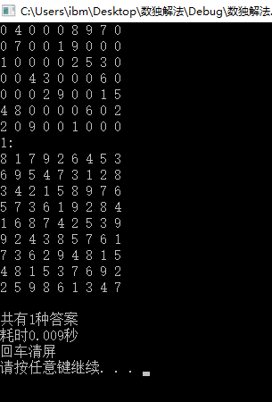

# **周兆伟的demo**  
## *1.Project Title*  
这是一个用c++编写的数独求解程序，可以对未完成的数独进行求解。输入一个九行九列的数独，便能得到答案个数并列出所有解答同时统计计算时间。  
## *2.Getting Started*  
需要安装Visual Studio 2017，并能正常使用。  
## *3.Usage*  
在Visual Studio 2017中打开项目“数独解法”。运行程序后，按照提示在窗口输入待求数独便可得到所有答案。  
## *4.Source Code*  
```c++
#include<iostream>
#include<ctime>
using namespace std;
void shendusousuo(short m, short n);
bool jiance(short m, short n, short k);
void display();
short a[9][9];
short sum;
int main()
{
	clock_t start, finish;
	while (1)
	{
		sum = 0;
		cout << "请输入数独，空格用0代替，数字与数字之间用空格隔开，共九行九列" << endl;
		int i, j;
		for (i = 0; i < 9; i++)
		{
			for (j = 0; j < 9; j++)
			{
				cin >> a[i][j];
			}
		}
		start = clock();
		shendusousuo(0, 0);
		finish = clock();
		double totaltime = double(finish - start) / CLOCKS_PER_SEC;
		cout << "共有" << sum << "种答案" << endl;
		cout << "耗时" << totaltime << "秒" << endl;
		cout << "回车清屏" << endl;
		system("pause");
		system("cls");
	}
}
void shendusousuo(short m, short n)
{
	if (!a[m][n])
	{
		short k;
		for (k = 1; k <= 9; k++)
		{
			if (jiance(m, n, k))
			{
				a[m][n] = k;
				if (n == 8)
				{
					if (m == 8)
					{
						display();
						break;
					}
					else
					{
						shendusousuo(m + 1, 0);
					}
				}
				else
				{
					shendusousuo(m, n + 1);
				}
			}
		}
		a[m][n] = 0;
	}
	else
	{
		if (n == 8)
		{
			if (m == 8)
			{
				display();
			}
			else
			{
				shendusousuo(m + 1, 0);
			}
		}
		else
		{
			shendusousuo(m, n + 1);
		}
	}
}
bool jiance(short m, short n, short k)
{
	int i;
	bool bo(1);
	for (i = 0; i < 9; i++)
	{
		if (a[i][n] == k || a[m][i] == k)
		{
			bo = 0;
			break;
		}
	}
	if (!bo)
	{
		return bo;
	}
	else
	{
		int p, q;
		p = 3 * (m / 3);
		q = 3 * (n / 3);
		int j;
		for (i = 0; i <= 2; i++)
		{
			for (j = 0; j <= 2; j++)
			{
				if (a[p + i][q + j] == k)
				{
					bo = 0;
					break;
				}
			}
			if (!bo)
			{
				break;
			}
		}
		return bo;
	}
}
void display()
{
	sum++;
	cout << sum << ":" << endl;
	for (int i = 0; i < 9; i++)
	{
		for (int j = 0; j < 9; j++)
		{
			cout << a[i][j] << " ";
		}
		cout << endl;
	}
	cout << endl;
}
```
## *5.Result*  
输入一组数独进行测试结果如下：  
  
由图可知程序运行良好。  
## *6.Contributing*  
华中科技大学电气1601周兆伟  