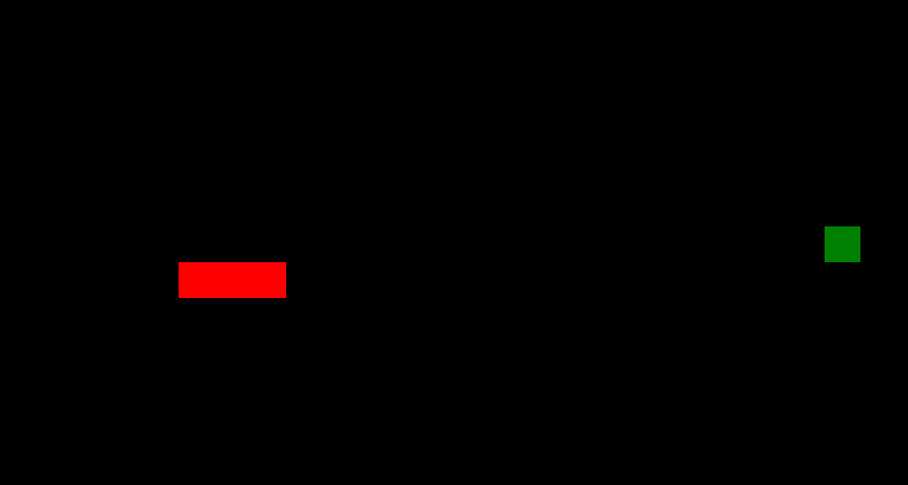

# HTML5实现简单的贪吃蛇小游戏

## 一、蛇身制作

蛇身由一系列方格组成，初始设定蛇身的长度是4，每吃到一次食物就增加1。

给组成蛇身的每一节一个坐标，并设定一个变量var lenth=4;来存放蛇身的长度。

最后用一个for循环for(i=0;i<lenth;i++)根据坐标，一个一个格子地画出蛇身。

## 二、蛇的前行

让下一节的坐标直接等于上一节当前的坐标就可以了。

```html
function move()
{for(i=(lenth-1);i>=1;i--)
 {worma[i]=worma[i-1];
  wormb[i]=wormb[i-1];}
}
```

第一节的坐标由蛇目前前进的方向（来自玩家的键盘输入）计算得出。

## 三、食物出现

使用random函数和floor函数来获得一个宽30高20范围内的随机坐标。

```html
function getfood()
{if(foodboolean==0)
 {fooda=Math.floor(Math.random()*20);
  foodb=Math.floor(Math.random()*30);
  foodboolean=1;
 }
```

## 四、判断是否咬到自己

如果蛇头（第一节）碰到了她自己身体的其他任意一节，那么这个时候，这2节的坐标是一样的。

我们可以根据这个来判断是不是咬到自己了。

```html
for(i=1;i<=lenth-1;i++)
{if ((worma[i]==worma[0])&&(wormb[i]==wormb[0]))
  {crash=1;}
}
```

## 五、自动前进和防止后退

键盘有4个方向，但是贪吃蛇在前进时，只有3个方向。我们只能让她向前，或左转，或右转，而不能向后转。所以如果玩家按了和当前前进方向相反的键盘按键，我们必须防止贪吃蛇反向移动。

方法是设定一个变量，direction，用于储存当前的移动方向。如果玩家没有新的输入，那么贪吃蛇一直沿原来的方向走；如果有新的输入，那么在判断新的方向“合法”之后，存入direction变量，取代原来的方向。

```html
function fkeydown(kd)
{if(Math.abs(direction-kd.keyCode)!=2)
 {dnext=kd.keyCode;};
}
```

## 六、最终代码

```html
<html>
<head>
<title>greedy snake from eev</title>
<script>
var x=0;
var y=0;
var i=0;
var a=0;
var b=0;
var fooda=0;
var foodb=0;
var foodboolean=0;
var lenth=4;
var timer=0;
var direction=39;
var dnext=39;
var crash=0;
var worma=new Array();
var wormb=new Array();
worma[0]=10;
wormb[0]=1;
worma[1]=9;
wormb[1]=1;
worma[2]=8;
wormb[2]=1;
worma[3]=7;
wormb[3]=1;
var nexta=10;
var nextb=1;
function getfood()
{if(foodboolean==0)
 {fooda=Math.floor(Math.random()*20);
  foodb=Math.floor(Math.random()*30);
  foodboolean=1;
 };
}
function next()
{direction=dnext;
 if (direction==37)
 {fleft();}
 else if(direction==38)
 {fup();}
 else if(direction==39)
 {fright();}
 else if(direction==40)
 {fdown();} 
}
function eat()
{lenth=lenth+1;
 move();
 foodboolean=0;
}
function eatormove()
{if((foodboolean==1)&&(nexta==fooda)&&(nextb==foodb))
 {eat();}
 else
 {move();};
}
function move()
{for(i=(lenth-1);i>=1;i--)
 {worma[i]=worma[i-1];
  wormb[i]=wormb[i-1];
 };
 worma[0]=nexta;
 wormb[0]=nextb;
}
function fleft()
{if(wormb[0]>=1)
 nextb=wormb[0]-1;
 else
 nextb=29;
}
function fright()
{if(wormb[0]<29)
 nextb=wormb[0]+1;
 else
 nextb=0;
}
function fup()
{if(worma[0]>=1)
 nexta=worma[0]-1;
 else
 nexta=19;
}
function fdown()
{if(worma[0]<19)
 nexta=worma[0]+1;
 else
 nexta=0;
}
function fkeydown(kd)
{if(Math.abs(direction-kd.keyCode)!=2)
 {dnext=kd.keyCode;};
}
function draw()
{ctx.clearRect(0,0,1200,800);
 for(i=0;i<=lenth-1;i++)
 {x=wormb[i]*40;
  y=worma[i]*40;
  ctx.fillStyle="red";
  ctx.fillRect(x,y,40,40);
 }
 if(foodboolean==1)
 {ctx.fillStyle="green";
  x=foodb*40;
  y=fooda*40;
  ctx.fillRect(x,y,40,40);
 } 
}
function refresh()
{timer=timer+1;
 for(i=1;i<=lenth-1;i++)
 {if ((worma[i]==worma[0])&&(wormb[i]==wormb[0]))
  {crash=1;};
 } 
 if ((timer%5==1)&&crash==0)
 {next();
  eatormove();
 };
 draw(); 
 getfood(); 
}
</script>
</head>
<body onkeydown="fkeydown(event)">
<canvas id="canvas01" width="1200" height="800" style="background-color:black">
</canvas>
<script>
var cvs=document.getElementById("canvas01");
var ctx=cvs.getContext("2d");
ctx.fillStyle="red";
var intval=setInterval("refresh();",100);
</script>
</body>
</html>
```

## 七、效果展示



