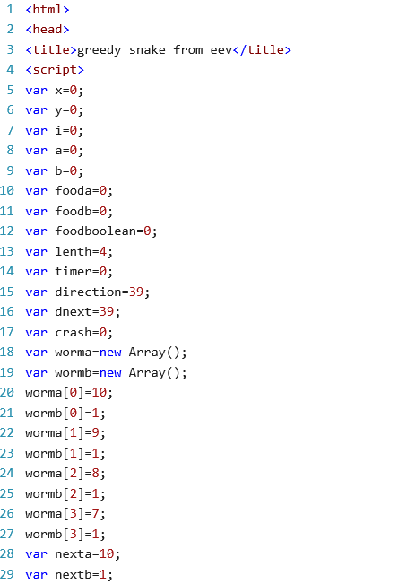

# Code Review
本文从定义变量和函数两个部分对贪吃蛇项目的代码进行评价。
## 定义变量
首先我们看代码最开始的定义变量部分,如下图：
从上图中我们可以明显发现有些变量名是无意义的命名，如x，y等，很容易让人搞不清楚含义，不利于别人阅读。并且其他变量的命名也不是常见的命名格式。
## 函数
从函数名来看，并无大问题，名称能反映函数的作用,但是有一个学长上课讲到的典型问题就是函数摆放的顺序没有按照其逻辑顺序,会让别人读起来感到费力。另外有几个短小的函数可以合在一个函数里面，比如左移，右移和前进可以合在next函数里面。另外，当贪吃蛇咬到自身时，游戏结束，但是没有重新开始的函数，这是代码结构不完整的一点。
## 总结
因为代码不多，所以只看出三个主要问题：1.变量的命名 2.函数的摆放顺序 3.代码结构不完整。
***
Reviewer: 气卓1601 李睿康

date：2018.08.18